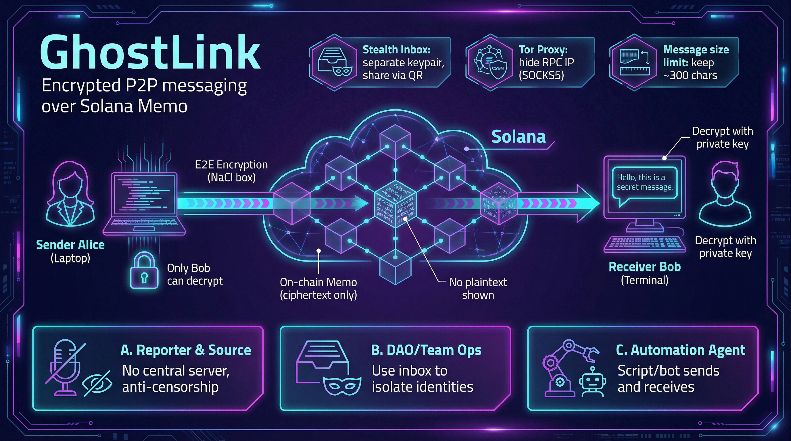

# GhostLink

End-to-end encrypted peer-to-peer messaging tool built on the Solana blockchain. Uses on-chain Memo storage and NaCl box asymmetric encryption for fully private messaging — only the recipient can decrypt and read messages.



## Features

- **End-to-end encryption** — NaCl box (Curve25519/XSalsa20/Poly1305), only the recipient's private key can decrypt
- **Zlib compression** — Automatic compression before encryption, ~2x effective message capacity for typical text
- **Fast memo filtering** — `GL1:` magic header prefix enables O(1) identification of GhostLink memos without decryption
- **On-chain storage** — Messages stored via Solana Memo Program, immutable and censorship-resistant
- **Stealth inboxes** — Locally generated inbox addresses, shared via QR code
- **MCP server** — Built-in Model Context Protocol server for native AI agent integration
- **Tor proxy** — Built-in SOCKS5 proxy support to hide IP addresses
- **Single binary** — Compiled with Go, cross-platform, no external dependencies

## Install

### Build from source

```bash
git clone https://github.com/ghost-link/ghost-link.git
cd ghost-link
make build
```

Binary output: `build/ghostlink`

### Cross-compile

```bash
make build-all
```

Supports Linux (amd64/arm64), macOS (amd64/arm64), Windows (amd64).

## Solana Network

GhostLink runs on the Solana blockchain. Three networks are available:

| Network | Description | Use case |
|---------|-------------|----------|
| **devnet** | Development network, free test SOL | Development and testing (default) |
| **testnet** | Test network | Pre-production testing |
| **mainnet** | Production network, real SOL | Real-world usage |

GhostLink defaults to **devnet**. You can switch networks with the `-u` flag or in config:

```bash
# Use devnet (default)
ghostlink send --to <address> -m "Hello"

# Use testnet
ghostlink send -u testnet --to <address> -m "Hello"

# Use mainnet
ghostlink send -u mainnet --to <address> -m "Hello"

# Use custom RPC endpoint
ghostlink send -u https://my-rpc.example.com --to <address> -m "Hello"
```

### Getting test SOL

On devnet, you can request free test SOL via the built-in airdrop command:

```bash
# Request 1 SOL (default)
ghostlink wallet airdrop

# Request a specific amount (max 2 SOL per request)
ghostlink wallet airdrop 2
```

No real money is needed for development and testing on devnet.

## Quick Start

### 1. Create a wallet

```bash
ghostlink wallet create
```

Set a password when prompted (press Enter to skip encryption). You'll see the wallet address and a 24-word mnemonic.

> **Back up your mnemonic safely — it cannot be recovered if lost!**

### 2. Send a message

```bash
ghostlink send --to <recipient-address> -m "Hello, this is an encrypted message"

# Specify network
ghostlink send -u mainnet --to <recipient-address> -m "Message content"
```

The message is encrypted with the recipient's public key and sent as a Solana Memo transaction.

### 3. Receive messages

```bash
ghostlink receive
```

Scans on-chain transactions, decrypts and displays received messages using the local private key.

## Command Reference

### Global Flags

| Flag | Description |
|------|-------------|
| `-u, --url` | Solana RPC (`devnet`, `testnet`, `mainnet` or custom URL) |
| `--tor` | Route requests through Tor proxy |
| `--tor-proxy` | Tor SOCKS5 proxy address (default `127.0.0.1:9050`) |
| `--config` | Config file path |
| `--json` | Output results as JSON |
| `--password` | Wallet password (avoids interactive prompt) |
| `--private-key` | Base58-encoded private key (bypasses wallet file) |

### wallet — Wallet Management

```bash
# Create a new wallet (keypair + mnemonic)
ghostlink wallet create [--path <path>]

# Import via private key
ghostlink wallet import --key <base58-private-key> [--path <path>]

# Import via mnemonic
ghostlink wallet import --mnemonic "word1 word2 ... word24" [--path <path>]

# Check SOL balance
ghostlink wallet balance [--path <path>]

# Request test SOL (devnet only, max 2 SOL)
ghostlink wallet airdrop [amount]
```

Wallet files are stored at `~/.ghostlink/wallet.json` by default. When a password is set, they are protected with AES-256-GCM encryption; otherwise stored as plaintext.

### send — Send Messages

```bash
ghostlink send --to <recipient-address> -m "Message content"
```

| Flag | Description | Required |
|------|-------------|----------|
| `--to` | Recipient Solana address | Yes |
| `-m, --message` | Message content (plaintext) | Yes |

**Limit:** Max 340 bytes uncompressed payload. With automatic zlib compression, typical text messages of ~600-800 bytes will fit within the 512-byte Solana Memo limit.

### receive — Receive Messages

```bash
ghostlink receive [--inbox <name-or-address>] [--limit 20] [--since 2024-01-01]
```

| Flag | Description | Default |
|------|-------------|---------|
| `--inbox` | Inbox name or address | Default inbox, or wallet address if not set |
| `--limit` | Max number of messages | 20 |
| `--since` | Filter by start date (YYYY-MM-DD) | None |

Priority: `--inbox` flag > config `default_inbox` > wallet address.

### inbox — Stealth Inboxes

```bash
# Create an inbox (default name: "default")
ghostlink inbox create [name]

# List all inboxes
ghostlink inbox list

# Set default inbox
ghostlink inbox set-default <name>

# Display inbox QR code in terminal
ghostlink inbox share [name]

# Export QR code as PNG
ghostlink inbox share [name] -o qrcode.png
```

Inboxes are independently generated keypairs, isolated from the main wallet. Senders scan the QR code to get the inbox address. Setting a default inbox lets `receive` work without specifying `--inbox` every time.

## End-to-End Example

Complete flow: Alice sends an encrypted message to Bob.

```bash
# === Bob (recipient) ===

# 1. Create wallet
ghostlink wallet create
# Output: Address: 7xKX...abc

# 2. Create stealth inbox
ghostlink inbox create bob-private
# Output: Address: 9yMN...xyz

# 3. Set as default inbox
ghostlink inbox set-default bob-private

# 4. Share QR code with Alice
ghostlink inbox share bob-private

# === Alice (sender) ===

# 1. Create wallet
ghostlink wallet create

# 2. Send encrypted message to Bob's inbox
ghostlink send --to 9yMN...xyz -m "Hi Bob, this is a secret message!"
# Output: Signature: 4vJ2...

# === Bob (recipient) ===

# 3. Receive messages (uses default inbox automatically)
ghostlink receive
# Output:
# ─────────────────────────────────────────
# From:      3aBC...def
# Time:      2024-03-01 12:00:00
# Signature: 4vJ2...
# Message:   Hi Bob, this is a secret message!
# ─────────────────────────────────────────
```

## MCP Server (AI Agent Integration)

GhostLink includes a built-in [Model Context Protocol](https://modelcontextprotocol.io) server, allowing AI agents to connect over stdio and call GhostLink tools natively — no shell parsing required.

### Start the MCP server

```bash
ghostlink mcp --password ""
```

### Available tools

| Tool | Description |
|------|-------------|
| `status` | RPC health, wallet, balance, config |
| `wallet_create` | Create a new wallet |
| `wallet_import` | Import from private key or mnemonic |
| `wallet_balance` | Check SOL balance |
| `wallet_airdrop` | Request devnet SOL |
| `send_message` | Encrypt and send a message |
| `receive_messages` | Fetch and decrypt messages |
| `inbox_create` | Create a stealth inbox |
| `inbox_list` | List all inboxes |

### Claude Desktop configuration

Add to `claude_desktop_config.json`:

```json
{
  "mcpServers": {
    "ghostlink": {
      "command": "/path/to/ghostlink",
      "args": ["mcp", "--password", ""]
    }
  }
}
```

### Test with JSON-RPC

```bash
echo '{"jsonrpc":"2.0","id":1,"method":"initialize","params":{"protocolVersion":"2024-11-05","capabilities":{},"clientInfo":{"name":"test","version":"1.0"}}}' | ghostlink mcp --password ""
```

## Tor Proxy

Use the `--tor` flag to route Solana RPC communication through Tor, hiding your IP address:

```bash
# Make sure Tor is running locally
# Ubuntu: sudo apt install tor && sudo systemctl start tor

# Send via Tor
ghostlink send --tor --to <address> -m "Anonymous message"

# Receive via Tor
ghostlink receive --tor

# Custom proxy address
ghostlink send --tor --tor-proxy 127.0.0.1:9150 --to <address> -m "Message"
```

Enable Tor by default in config:

```json
{
  "tor_enabled": true,
  "tor_proxy": "127.0.0.1:9050"
}
```

## Configuration

Config file: `~/.ghostlink/config.json`

```json
{
  "network": "devnet",
  "rpc_url": "https://api.devnet.solana.com",
  "wallet_path": "",
  "tor_enabled": false,
  "tor_proxy": "127.0.0.1:9050",
  "default_inbox": ""
}
```

| Field | Description | Default |
|-------|-------------|---------|
| `network` | Solana network (`devnet`, `testnet`, `mainnet`) | `devnet` |
| `rpc_url` | Custom Solana RPC endpoint | `https://api.devnet.solana.com` |
| `wallet_path` | Wallet file path | `~/.ghostlink/wallet.json` |
| `tor_enabled` | Enable Tor by default | `false` |
| `tor_proxy` | Tor SOCKS5 proxy address | `127.0.0.1:9050` |
| `default_inbox` | Default inbox name | None |

Priority: `-u` flag > config `network` > config `rpc_url` > default devnet.

Command-line flags override config file values.

## Project Structure

```
ghost-link/
├── cmd/ghostlink/           # CLI entry point and subcommands
│   ├── main.go              # Root command
│   ├── wallet_cmd.go        # wallet create/import/balance/airdrop
│   ├── send_cmd.go          # send
│   ├── receive_cmd.go       # receive
│   ├── inbox_cmd.go         # inbox create/list/share/set-default
│   ├── mcp_cmd.go           # mcp (MCP server)
│   └── status_cmd.go        # status
├── internal/
│   ├── wallet/              # Wallet management (keygen, encrypted storage)
│   ├── crypto/              # NaCl box encryption/decryption
│   ├── solana/              # Solana RPC client, Memo transactions
│   ├── mcp/                 # MCP server and tool handlers
│   ├── inbox/               # Inbox store types and I/O
│   ├── tor/                 # SOCKS5 Tor proxy
│   └── config/              # Config file management
├── Makefile                 # Build scripts
├── PRD.md                   # Product requirements
└── TODO.md                  # Development progress
```

## Security

- **Private keys are stored locally only**, optionally encrypted with scrypt + AES-256-GCM
- **Messages are end-to-end encrypted**, only ciphertext is stored on-chain
- **Mnemonic is the only way to recover a wallet** — back it up offline, never share it
- Each message costs a small amount of SOL for transaction fees (fees and SOL price fluctuate)
  - Example: 0.000005 SOL per message
  - 200,000 messages ≈ 1 SOL
  - If 1 SOL = $100, then ≈ $0.0005 per message
- **On-chain messages are irreversible** — verify content and recipient before sending
- Use Tor proxy for additional IP-level privacy

## Technical Specs

| Item | Details |
|------|---------|
| Language | Go |
| Blockchain | Solana (devnet / testnet / mainnet) |
| Storage | Solana Memo Program (≤ 512 bytes) |
| Wire Format | `GL1:` prefix + base64(nonce + NaCl_box(flag + payload)) |
| Encryption | NaCl box (Curve25519 + XSalsa20 + Poly1305) |
| Compression | Zlib (auto, applied when beneficial) |
| Keys | Ed25519 → X25519 conversion |
| Wallet Encryption | scrypt + AES-256-GCM |
| Mnemonic | BIP39 (24 words / 256-bit entropy) |
| Proxy | SOCKS5 (Tor) |

## Development

```bash
# Run tests
make test

# Lint
make lint

# Build
make build

# Clean
make clean
```

## License

MIT
